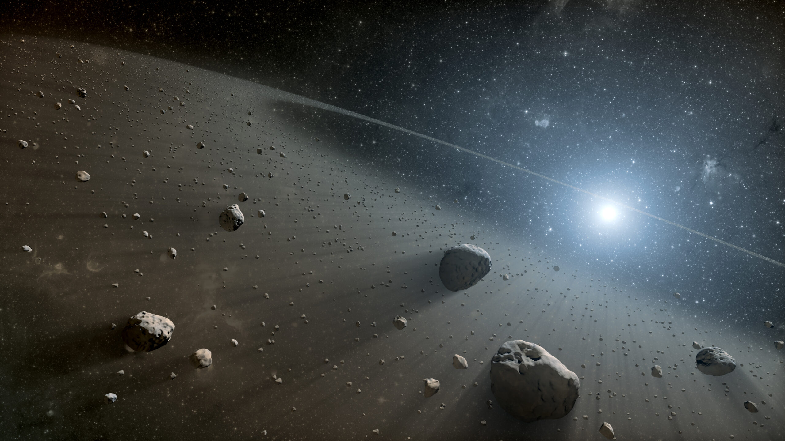

# EDA-Asteroids

## 1. Introduction:
 The Solar System has been filled with millions of minor bodies of different sizes and compositions since its early days. After millions of years of evolution, the Solar System has reached an apparent *equilibrium*-like state, where there are no big sudden changes in the distribution of planets and larger bodies. However, smaller bodies are specially vulnerable to orbital perturbations exherted by planets or even nearby stars that pass close to the Oorb's Clud outernmost layers.

 This perturbations change the orbital parameters and can make asteroids and comets collide with planets. Such collisions between a minor body and Earth, have in many cases proved to be catastrophical for life on Earth and suppose a great danger for the well being of humankind.

 Understanding the main characteristics of Solar System's minor bodies can lead us to a better understanding of Earth's future *not so lovely* neighbours.
 
 This *Exploratory Data Analysis* analyzes a dataset containg information on more than $10^5$ asteroids in the Solar System.

## 2. Data:
The dataset analyzed in these *EDA*, which can be accessed [here](https://www.kaggle.com/datasets/adilshamim8/asteroid-dataset), contains the following information for more than $10^5$ asteroids from different regions of the Solar System:
- Name and unique identifier.
- Class: a classifying variable, this parameter specifies the group to which the asteroid belongs.
- Diameter: given in $km$.
- Orbital parameters:
  - Semi-major axis: $a$, given in $AU$ ($1\,AU \approx 1.49\times 10^6 \,km$).
  - Eccentricity: $e$, a parameter related to the non-circularity of an orbit.
  - Perihelion and Aphelion distance: $q$ and $a_d$, closest and farest distance to the Sun in the orbit, respectively.
  - Inclination: $i$, given in $^\circ$, the angle between the orbital and the ecliptic plane.
  - Orbital period: given in years or days, time taken by the asteroid to orbit the sun.
  - And many more!
- Brightness parameters:
  - Absolute magnitude: $H$ (differs from the definition of absolute magnitude for stars), related to the total brightness of a non-star body.
  - Albedo: related to the reflectance of the body.
- **pha**: a boolean, perhaps one of the most interesting parameters, True if the asteroids could impact Earth, False if otherwise.

## Hypothesis:
1. Initial analysis of the dataset:
- What are the ranges of semi-major axis and eccentricity (a measure of an orbit's non-circularity)?
- How many asteroids have an eccentricity bigger than 1? Orbits with eccentricity values in the range $0 < e < 1$ are bound orbits, whilst those with values $e > 1$ are parabolic or hyperbolic, meaning that they will leave the Solar System in the future.

2. Main characteristics vs Asteroid classification:
- One of the most extended asteroid classification criteria (and the one used in the dataset) is based on orbital parameters. Check how the **semi-major axis** and **orbital period** varies between different asteroid groups.
- Check how different groups of asteroids have different values of **eccentricity** (a measure of an orbit's non-circularity).
- Check how different groups of asteroids have different values of the inclination (the angle between the ecliptic plane and the orbit plane).
- Check the absolute magnitude ($H$, a measure of an objects total brightness) is distributed between different asteroid groups.
- Check how the values of the albedo are distributed between different asteroid groups (albedo $\alpha$ is a measure of an objects intrinsic brightness). Does the albedo increase with the orbital distance (semi-major axis)? Those asteroids closer to the Sun located below the ice-line would have probably lost all their *icy* componentes. Those asteroids far away from the sun (TNOs, ...) still keep those substances.
- Can the size of the asteroid be estimated from the absolute magnitude and the albedo? If that's the case, are the asteroids in the main belt the biggest asteroids in the Solar System?
